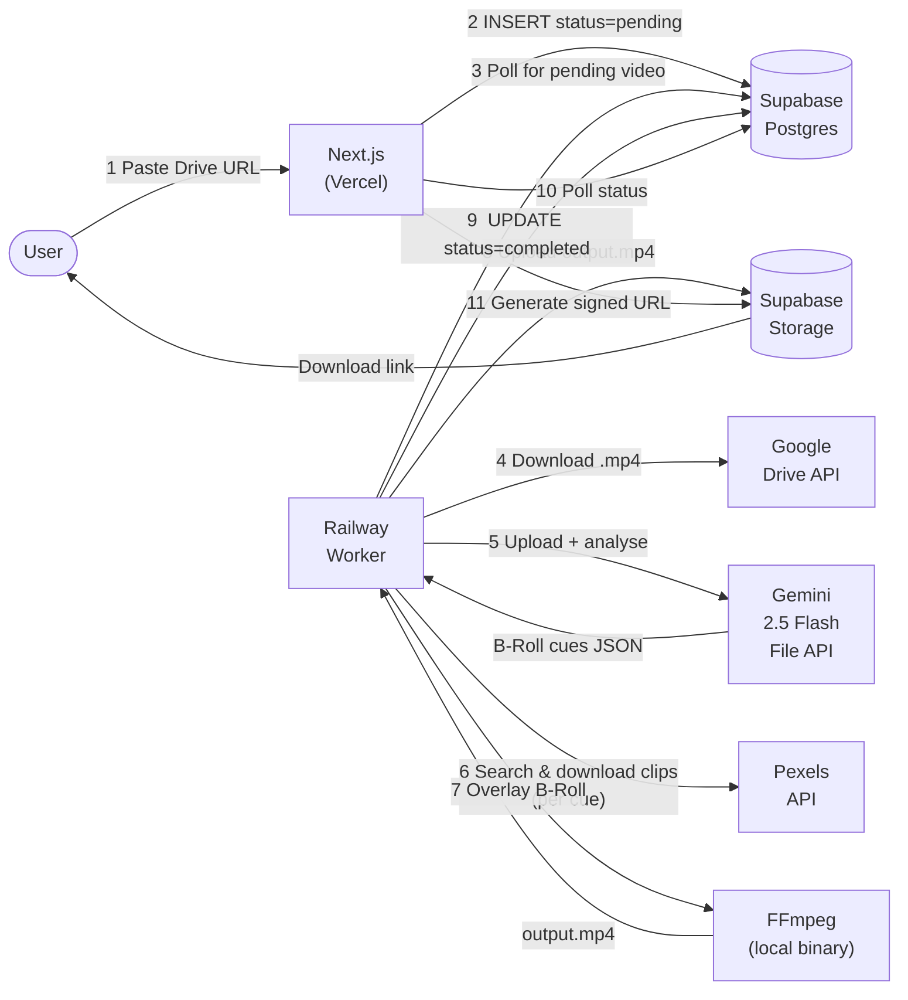

# AI B-Roll Video Editor

**An AI agent that automatically splices relevant B-Roll into talking-head videos.**

Paste a Google Drive link to your raw video. Gemini 2.5 Flash analyzes it, identifies the top 3–5 moments where B-Roll would boost engagement, sources matching stock clips from Pexels, and FFmpeg overlays them — all without touching a timeline editor.

🔗 **Live Demo:** [ai-broll-video-editor-deploy.vercel.app](https://ai-broll-video-editor-deploy.vercel.app)

[](https://nextjs.org)
[](https://react.dev)
[](https://www.typescriptlang.org)
[](https://tailwindcss.com)
[](https://supabase.com)
[](https://deepmind.google/technologies/gemini)
[](https://ffmpeg.org)
[](https://www.pexels.com/api)
[](https://playwright.dev)
[](https://railway.app)

---

## Architecture



---

## Features

- **Zero-touch editing** — submit a link, receive a finished video.
- **AI-powered cue detection** — Gemini 2.5 Flash identifies the exact timestamps where B-Roll adds the most value, returning structured JSON with `start_time`, `end_time`, and a precise `visual_description` for each cue.
- **Automatic stock footage** — each cue is matched to a relevant Pexels video clip (HD preferred), downloaded and overlaid automatically.
- **Frame-accurate overlay** — FFmpeg letterboxes B-Roll to match the main video's resolution, activating each clip only during its cue window.
- **Async worker pattern** — long-running processing runs on a persistent Railway worker, keeping the Next.js app fast and within serverless limits.
- **Real-time status polling** — the dashboard polls every 3 s; the video result page every 5 s until processing completes.
- **Signed download URLs** — completed videos are stored privately in Supabase Storage and served via 1-hour signed URLs.
- **Row-Level Security** — every DB row and storage object is scoped to the owning user; no cross-user data leakage.

---

## Tech Stack

| Layer | Technology | Version |
|---|---|---|
| Framework | Next.js (App Router) | 16.1.6 |
| UI | React | 19.2.3 |
| Language | TypeScript | 5 |
| Styling | Tailwind CSS + shadcn/ui | v4 |
| Database & Auth | Supabase (PostgreSQL + Auth) | `@supabase/supabase-js` 2.98.0 |
| SSR Auth | `@supabase/ssr` | 0.8.0 |
| AI Analysis | Google Gemini 2.5 Flash | `@google/generative-ai` 0.24.1 |
| Video source | Google Drive API v3 | — |
| Stock footage | Pexels API | — |
| Video processing | FFmpeg + FFprobe (static) | `ffmpeg-static` 5.3.0 |
| Validation | Zod | 4.3.6 |
| Icons | Lucide React | 0.575.0 |
| Testing | Playwright | 1.58.2 |
| Worker runtime | Node.js + `tsx` | 4.19.2 |
| Deployment | Vercel (app) + Railway (worker) | — |

---

## Getting Started

### Prerequisites

- Node.js 20+
- A Supabase project (free tier works)
- API keys for Gemini, Google Drive, and Pexels (see [Environment Variables](#environment-variables))
- FFmpeg installed locally **only** if you run the worker outside Docker/Railway

### Installation

```bash
git clone https://github.com/your-username/ai-broll-video-editor.git
cd ai-broll-video-editor
npm install
```

Copy the example env file and fill in your keys:

```bash
cp .env.example .env.local
```

Apply the database migration in your Supabase project (SQL Editor or CLI):

```sql
CREATE TABLE videos (
  id UUID DEFAULT gen_random_uuid() PRIMARY KEY,
  user_id UUID REFERENCES auth.users(id) ON DELETE CASCADE,
  source_url TEXT NOT NULL,
  status VARCHAR(50) DEFAULT 'pending',
  metadata JSONB,
  output_url TEXT,
  created_at TIMESTAMP WITH TIME ZONE DEFAULT NOW(),
  updated_at TIMESTAMP WITH TIME ZONE DEFAULT NOW()
);

ALTER TABLE videos ENABLE ROW LEVEL SECURITY;

CREATE POLICY "users_own_videos" ON videos
  FOR ALL USING (auth.uid() = user_id) WITH CHECK (auth.uid() = user_id);
```

Create a private Storage bucket named `videos` and enable RLS with:

```sql
CREATE POLICY "users_own_objects" ON storage.objects
  FOR ALL USING (split_part(name, '/', 1) = auth.uid()::text);
```

### Running Locally

Start the Next.js app and the worker in two separate terminals:

```bash
# Terminal 1 — Next.js dev server
npm run dev

# Terminal 2 — Railway polling worker
npm run worker:start
```

Open [http://localhost:3000](http://localhost:3000), sign up, and paste a public Google Drive video link.

---

## Environment Variables

| Variable | Where to get it | Required by |
|---|---|---|
| `NEXT_PUBLIC_SUPABASE_URL` | Supabase project Settings → API | App + Worker |
| `NEXT_PUBLIC_SUPABASE_ANON_KEY` | Supabase project Settings → API | App |
| `SUPABASE_SERVICE_ROLE_KEY` | Supabase project Settings → API | Worker |
| `GEMINI_API_KEY` | [aistudio.google.com](https://aistudio.google.com) | Worker |
| `GOOGLE_DRIVE_API_KEY` | [console.cloud.google.com](https://console.cloud.google.com) → Credentials | Worker |
| `PEXELS_API_KEY` | [pexels.com/api](https://www.pexels.com/api) (free, 200 req/hr) | Worker |
| `PLAYWRIGHT_TEST_EMAIL` | A Supabase test user you create | E2E tests only |
| `PLAYWRIGHT_TEST_PASSWORD` | — | E2E tests only |

---

## Project Structure

```
src/
├── app/
│   ├── (auth)/                    # Login / signup pages
│   ├── auth/callback/route.ts     # Supabase OAuth callback
│   ├── dashboard/
│   │   ├── layout.tsx             # Sidebar + topbar shell
│   │   ├── page.tsx               # URL input + video list
│   │   └── videos/[id]/page.tsx   # Player + Gemini JSON panel
│   ├── api/
│   │   ├── videos/route.ts        # POST (create) / GET (list)
│   │   └── videos/[id]/route.ts   # GET status + signed download URL
│   └── layout.tsx / page.tsx
├── components/
│   ├── ui/                        # shadcn/ui primitives
│   └── features/
│       ├── auth/SignOutButton.tsx
│       └── video/
│           ├── VideoUrlInput.tsx   # Drive URL input + Generate button
│           ├── VideoList.tsx       # Table with 3 s polling
│           ├── VideoStatusBadge.tsx
│           └── VideoPoller.tsx     # Invisible: router.refresh() every 5 s
├── lib/
│   ├── supabase/
│   │   ├── client.ts              # Browser Supabase client
│   │   ├── server.ts              # Server Supabase client (SSR)
│   │   └── admin.ts               # Service-role admin client
│   ├── gemini.ts                  # uploadVideoToGemini() + analyzeVideoForBRoll()
│   ├── drive.ts                   # parseDriveFileId() + downloadDriveFile()
│   └── pexels.ts                  # searchAndDownloadBRoll()
├── services/videoProcessor/
│   ├── analyze.ts                 # Full 7-step processVideo() pipeline
│   └── ffmpeg.ts                  # overlayBRoll() via child_process.spawn
├── types/database.ts              # Supabase-generated types + VideoRow, GeminiMetadata
└── proxy.ts                       # Next.js 16 auth guard (not middleware.ts)

worker/
└── index.ts                       # Railway poller — picks up pending videos every 15 s

tests/
├── auth.spec.ts                   # 4 auth flow tests
├── video-creation.spec.ts         # 1 project creation test (mocked API)
└── helpers/
```

---

## Processing Pipeline

`processVideo()` in [src/services/videoProcessor/analyze.ts](src/services/videoProcessor/analyze.ts) runs these 7 steps on the Railway worker:

| Step | Action |
|---|---|
| 1 | Update DB `status → "processing"` |
| 2 | Download the Google Drive video → `/tmp/broll-main-{id}.mp4` (500 MB max) |
| 3 | Upload video to Gemini File API, poll until ready, call `analyzeVideoForBRoll()` → JSON cues |
| 4 | For each B-Roll cue: `searchAndDownloadBRoll(visual_description)` → `/tmp/broll-clip-{id}-{n}.mp4` |
| 5 | `overlayBRoll(main, clips, output)` via FFmpeg filter_complex → `/tmp/broll-out-{id}.mp4` |
| 6 | Upload `output.mp4` to Supabase Storage at `{userId}/{videoId}/output.mp4` |
| 7 | Update DB: `status → "completed"`, `metadata = gemini cues`, `output_url = storage path` |

On any error the DB status is set to `"failed"` and the error message stored in `metadata.error`. Temp files are cleaned up in a `finally` block.

---

## API Reference

### `POST /api/videos`

Creates a new video job.

**Request body**
```json
{ "source_url": "https://drive.google.com/file/d/<id>/view" }
```

**Response** `201`
```json
{ "id": "uuid" }
```

The Railway worker picks up the record within 15 seconds and begins processing.

---

### `GET /api/videos`

Returns all videos for the authenticated user, ordered newest first.

**Response** `200` — array of `VideoRow` objects.

---

### `GET /api/videos/[id]`

Returns status and metadata for a single video. If `status === "completed"`, a 1-hour signed `download_url` is included.

**Response** `200`
```json
{
  "id": "uuid",
  "status": "completed",
  "metadata": {
    "b_roll_cues": [
      {
        "start_time": "00:01:15",
        "end_time": "00:01:25",
        "visual_description": "A cinematic aerial shot of a busy city at dusk",
        "reason": "Speaker references urban growth — a city shot reinforces the point visually"
      }
    ]
  },
  "download_url": "https://..."
}
```

---

## Testing

```bash
# Run all E2E tests (headless)
npm run test:e2e

# Run with Playwright UI (debug mode)
npm run test:e2e:ui

# Open last HTML report
npm run test:e2e:report
```

**2 test suites, 5 tests total:**

- **`tests/auth.spec.ts`** (4 tests) — login page renders, unauthenticated redirect to `/login`, valid credentials redirect to `/dashboard` with sidebar visible, sign-out returns to `/login`.
- **`tests/video-creation.spec.ts`** (1 test) — intercepts `POST /api/videos` with `page.route()`, inserts a real "pending" record via admin client, asserts the record appears in the video table with a `Pending` badge, then cleans up.

Tests run serially (1 worker) against `http://localhost:3000`. The Playwright config auto-starts `npm run dev` if a server isn't already running.

---

## Deployment

### Next.js App → Vercel

Deploy normally. The `next.config.ts` excludes `ffmpeg-static` and `ffprobe-static` from the Vercel function bundle — those binaries are only needed on the worker.

Required environment variables on Vercel: `NEXT_PUBLIC_SUPABASE_URL`, `NEXT_PUBLIC_SUPABASE_ANON_KEY`.

### Worker → Railway

The worker (`worker/index.ts`) is a long-running Node.js process. Deploy it to [Railway](https://railway.app) as a separate service pointing to the same repo with start command:

```bash
npx tsx worker/index.ts
```

Required environment variables on Railway: `NEXT_PUBLIC_SUPABASE_URL`, `SUPABASE_SERVICE_ROLE_KEY`, `GEMINI_API_KEY`, `GOOGLE_DRIVE_API_KEY`, `PEXELS_API_KEY`.

FFmpeg is available in Railway's default Node environment. For Docker deployments, use an Alpine image with `ffmpeg` installed via `apk add ffmpeg`.

---

## Technical Challenges & Solutions

### 1. Server-side FFmpeg vs. WASM

`ffmpeg.wasm` runs in the browser but is prohibitively slow for multi-clip overlays and blows through the browser's memory limit on any file larger than ~100 MB. The alternative — running FFmpeg inside a Vercel serverless function — is blocked by the 50 MB function size limit (the `ffmpeg-static` binary alone is ~70 MB).

**Solution:** Split the system into two deployments. The Next.js app (Vercel) handles auth, API routes, and UI. A separate Railway worker runs as a persistent Node.js process with access to the full `ffmpeg-static` binary. `next.config.ts` excludes the binary from Vercel's file-tracing so the Next.js build stays under the limit.

### 2. Reliable Structured Output from Gemini

Prompting an LLM to return JSON often results in markdown fences, extra commentary, or subtly wrong schemas that break `JSON.parse`. For a production pipeline where downstream FFmpeg depends on exact timestamp strings, this is unacceptable.

**Solution:** Use Gemini's `responseSchema` parameter (part of the `generationConfig`) to enforce the output format at the model level. The schema specifies required fields (`start_time`, `end_time`, `visual_description`, `reason`) and their types. The model is constrained to return only valid JSON matching that schema — no parsing heuristics needed.

### 3. Serverless Timeout for Long-Running Jobs

Video analysis (Gemini File API upload + inference) plus FFmpeg encoding can take 2–10 minutes for a typical talking-head video. Vercel serverless functions time out at 10–60 seconds.

**Solution:** The API route (`POST /api/videos`) only creates a database record with `status: "pending"` and returns immediately with the video ID. The Railway worker polls Supabase every 15 seconds for pending records and runs the full pipeline in a durable process. The frontend polls the `/api/videos/[id]` endpoint until `status` transitions to `completed` or `failed`.

### 4. Frame-Accurate B-Roll Alignment with FFmpeg

Overlaying multiple B-Roll clips at specific timestamps in a single FFmpeg pass requires each input to be offset in time. A naive approach (re-encoding segments separately and concatenating) produces visible cuts and loses the original audio sync.

**Solution:** Use FFmpeg's `-itsoffset {start_seconds}` flag before each B-Roll input. This shifts the input stream forward in time so that frame 0 of the B-Roll aligns with `start_time` in the main timeline. The `filter_complex` then chains overlays sequentially — each one gated with `enable='between(t,start,end)'` — so only the active clip is visible during its window. B-Roll is scaled with `force_original_aspect_ratio=decrease` and letterboxed to the exact main video dimensions to handle mismatched aspect ratios. The `-movflags +faststart` flag moves the MOOV atom to the front of the file for immediate browser playback before the full download completes.

---

## Future Improvements

The following were explicitly deferred for the MVP to keep scope manageable:

- **Visual timeline editor** — drag-and-drop clip positioning in the browser (would require `ffmpeg.wasm` or a WebSocket-driven render server).
- **FFmpeg microservice in Go** — replace the Node.js worker with a Go binary for lower memory overhead and faster concurrent processing.
- **AI-generated B-Roll** — integrate Replicate (Stable Video Diffusion or similar) to generate custom footage from the Gemini `visual_description` instead of relying on Pexels stock.
- **Stripe usage-based billing** — charge per minute of video processed.
- **WebSocket progress updates** — push real-time step-by-step progress (downloading, analyzing, overlaying) instead of polling.
- **Broader video sources** — support YouTube links (via `yt-dlp`), Dropbox, and direct `.mp4` uploads in addition to Google Drive.
- **Transcript-based analysis** — extract audio → Whisper transcription → send text to Gemini instead of the raw video, reducing Gemini API costs on long videos.
